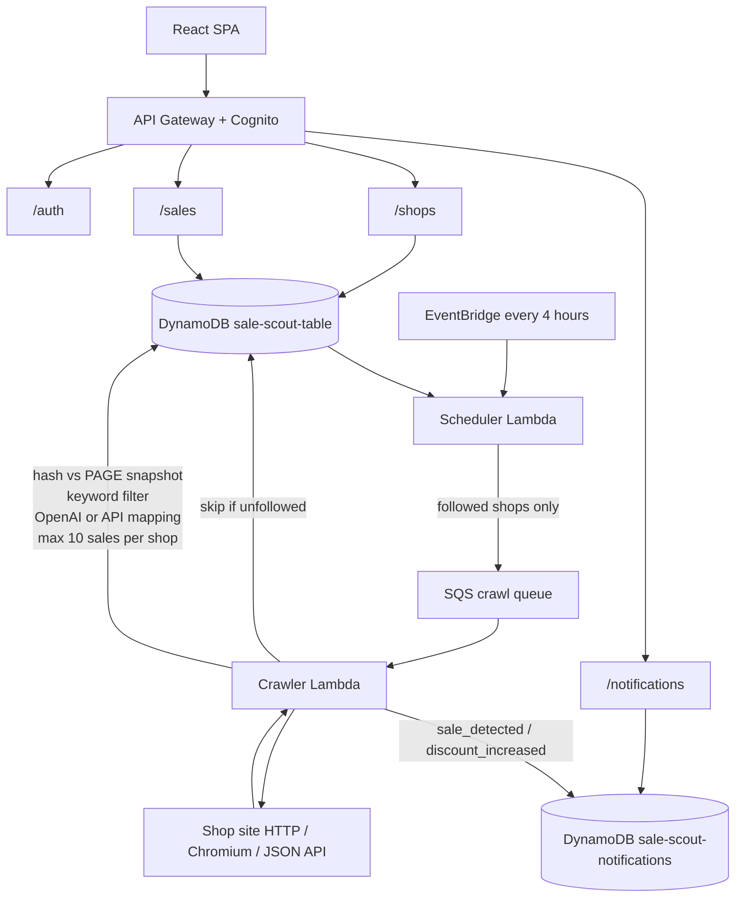

# Sale 🛍️

**Sale** is a mobile-style shopping companion that watches the stores you follow and surfaces new sales and price drops as they appear.

Sale is a **watcher, not a store**. It doesn't sell products directly — when you find something you like, Sale takes you to the shop's original product page to make the purchase.

## ✨ Features

- 🔐 Sign up and log in (Amazon Cognito)
- 🏪 Discover shops from a predefined catalog and follow them
- 🛍️ Home feed shows sales **only from shops you follow**
- 💰 Detect discounts from HTML pages, JS-rendered pages, or shop JSON APIs
- ❤️ Save deals locally in the browser
- 🔔 Notifications for new sales and deeper discounts
- 🔗 Open the original shop page to purchase
- 🚫 Unfollow a shop to stop crawling it and remove its sales from the app

## 🛠️ Tech Stack

### Frontend

- Vite 7
- React 19
- TypeScript
- React Router 7

### Backend

- AWS SAM
- AWS Lambda
- API Gateway
- DynamoDB
- Amazon SQS
- Amazon EventBridge
- Amazon Cognito

### Crawling

- `http` / `https` — Node `fetch` + Cheerio
- `browser` — `puppeteer-core` + `@sparticuz/chromium-min` for JS-rendered shops
- `api` — JSON catalog fetch with field mapping (no OpenAI)

## 🚀 Getting Started

The app lives under `frontend/`. The API lives under `backend/`.

### Prerequisites

- Node.js 20+
- npm
- AWS CLI + SAM CLI (to deploy the backend)

### Frontend

```bash
cd frontend
npm install
npm run dev
```

The app will be available at:

```text
http://localhost:5173
```

The API base URL is `frontend/.env`:

```bash
VITE_API_BASE=https://mkntb4mjx9.execute-api.us-east-1.amazonaws.com/Prod
```

Override it when needed:

```bash
VITE_API_BASE=https://your-api.example.com/Prod npm run dev
```

Restart Vite after changing `.env`.

### Backend

```bash
cd backend
npm install
npm test
npm run deploy
```

`npm run deploy` runs `sam build && sam deploy`. After a new stack, copy the `ApiUrl` output (without `/sales`) into `frontend/.env`.

## 🔌 Deployed API

Stack `sale-scout` in `us-east-1`:

```text
API            https://mkntb4mjx9.execute-api.us-east-1.amazonaws.com/Prod
Catalog        https://mkntb4mjx9.execute-api.us-east-1.amazonaws.com/Prod/shops/catalog
Shops          https://mkntb4mjx9.execute-api.us-east-1.amazonaws.com/Prod/shops
Sales          https://mkntb4mjx9.execute-api.us-east-1.amazonaws.com/Prod/sales
Notifications  https://mkntb4mjx9.execute-api.us-east-1.amazonaws.com/Prod/notifications
Signup         https://mkntb4mjx9.execute-api.us-east-1.amazonaws.com/Prod/auth/signup
Login          https://mkntb4mjx9.execute-api.us-east-1.amazonaws.com/Prod/auth/login
User pool      us-east-1_K7Sch2j5P
App client     3ql4tkej8atd6n5m7hsosruqto
```

Auth, shops, sales, and notifications all use that API base. A new Cognito pool means previous accounts do not carry over — sign up again.

## 📱 What Sale Does

### Follow shops

The catalog is defined in `backend/shops/catalog.json` and **bundled into Lambda at deploy time**. It is not editable in the AWS console. Change the file locally and redeploy.

Current catalog shops:

| shopId | Strategy | Site |
| --- | --- | --- |
| `catalog108` | `browser` | practice.scrapingcentral.com |
| `dummyjson` | `api` | dummyjson.com/products |
| `scrapify-js` | `browser` | scrapifydatalabs.com playground |

Following a shop writes its metadata to DynamoDB. That does **not** crawl immediately. EventBridge runs the scheduler every **4 hours**, which enqueues SQS jobs for followed shops only.

### Discover sales

The home feed, saved list, and notifications show data from **followed shops only**.

### Unfollow

Unfollowing:

1. Deletes the shop partition (`METADATA`, `PAGE#` snapshots, `SALE#` rows)
2. Deletes that shop’s notifications
3. Makes the crawler skip leftover SQS jobs for that shop
4. Removes the shop and its sales from the app immediately

### Product details

The frontend can fetch a product page (via the Vite proxy) to show description, images, categories, specs, and reviews when the shop HTML includes them. Purchase still happens on the original shop site.

### Saved items

Saved deals are stored in the browser. Unfollowing a shop removes its saved items from the list.

### Notifications

```http
GET /notifications
POST /notifications/{notificationId}/read
```

Unread badges come from `sale_detected` and `discount_increased` events. Notifications for unfollowed shops are not returned.

## 🏗️ Architecture



### Shop → Pages → Sales

```text
Follow shop
  → SHOP#{id} / METADATA
  → Scheduler (every 4h) enqueues pagesToMonitor
  → Crawler fetches each page
  → Extract + hash; skip if PAGE# snapshot unchanged
  → Detect discounts (OpenAI or API mapping)
  → Write PAGE# snapshot
  → Write SALE# rows (≤10) + notification
  → Optionally enqueue product/category links
```

Single-table layout:

```text
SHOP#{shopId}
 ├── METADATA          crawl config for a followed shop
 ├── PAGE#/deals       last extracted snapshot + content hash
 ├── PAGE#/products
 ├── SALE#{date}#{fp}  detected discount
 └── SALE#{date}#{fp}
```

- **METADATA** controls what to crawl.
- **PAGE#** stores the last seen extract (title, headings, prices, links, item snippets). It is not a structured product catalog.
- **SALE#** is what the app shows. Fingerprints prevent duplicates; a later crawl can update the row if the discount increased.

## ⚙️ Backend

### Scheduler

Loads followed shops from DynamoDB and enqueues one SQS job per `pagesToMonitor` path. If nobody is following a shop, it is not crawled.

### Crawler

1. Skip the job if the shop is no longer followed
2. Fetch the page:
   - `http` / `https` — plain fetch
   - `browser` — headless Chromium (downloads `chromium-v153.0.0-pack.x64.tar` at runtime)
   - `api` — JSON fetch + `api` field mapping
3. Extract content (Cheerio for HTML)
4. SHA-256 compare against the previous `PAGE#` snapshot — skip if unchanged
5. Keyword pre-filter (HTML shops)
6. OpenAI (`gpt-4o-mini`) for HTML shops, or mapped discounts for API shops
7. Save at most **10 sales per shop**, then enqueue matching follow links if slots remain

Browser crawls use:

- `puppeteer-core`
- `@sparticuz/chromium-min` (remote pack, not the full Chromium zip)

Pack URL:

```text
https://github.com/Sparticuz/chromium/releases/download/v153.0.0/chromium-v153.0.0-pack.x64.tar
```

### Authentication

```text
POST /auth/signup
POST /auth/confirm
POST /auth/login
POST /auth/refresh
POST /auth/resend
GET  /auth/me
```

### Shops

```text
GET    /shops/catalog
GET    /shops
POST   /shops                 { "shopIds": ["catalog108"] }
DELETE /shops/{shopId}
```

### Database

```text
sale-scout-table
├── SHOP#{id} / METADATA
├── SHOP#{id} / PAGE#{path}
└── SHOP#{id} / SALE#{date}#{fingerprint}

sale-scout-notifications
└── notification rows (sale_detected, discount_increased)
```

## 📁 Project Structure

```text
sale/
├── frontend/
│   ├── src/
│   │   ├── api/          API client and types
│   │   ├── context/      shops, sales, saved, notifications, auth
│   │   ├── lib/          auth, storage, product-page HTML parse
│   │   ├── screens/      Welcome, Login, Signup, Home, Shop, Item, Saved, Search, Profile
│   │   └── components/
│   └── .env              VITE_API_BASE
└── backend/
    ├── shops/catalog.json
    ├── src/
    │   ├── scheduler/    EventBridge → SQS
    │   ├── crawler/      SQS → fetch, hash, detect, save
    │   ├── api/          auth, shops, sales, notifications
    │   └── shared/       extractors, DynamoDB, AI, limits
    ├── template.yaml
    └── Makefile          crawler Lambda bundle
```

## 📌 Project Status

**Version:** `0.1.0`

Sale is a prototype for automated shopping-sale discovery and monitoring.
