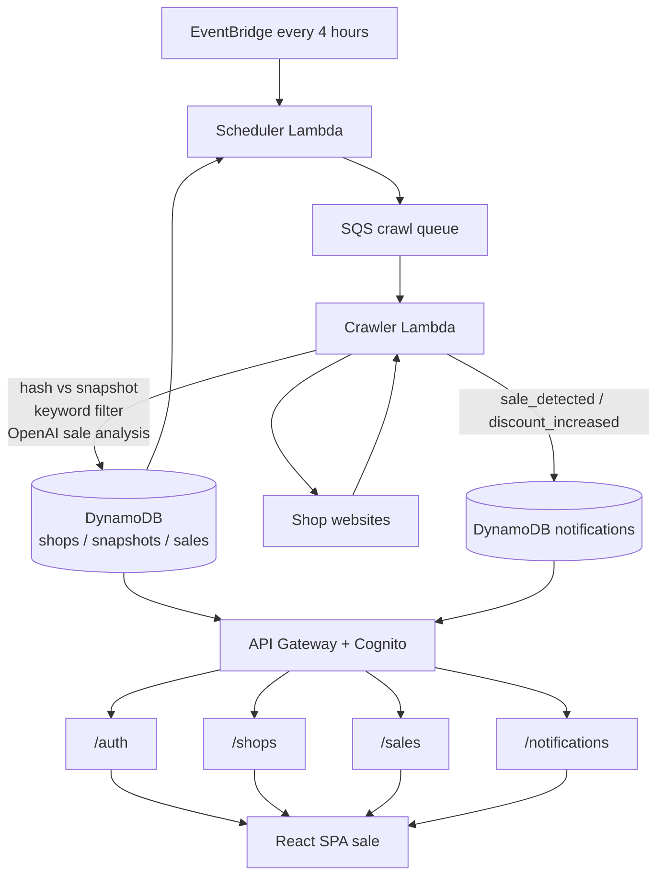

# Sale 🛍️

**Sale** is a mobile-style shopping companion that watches the stores you follow and surfaces new sales and price drops as they appear.

Sale is a **watcher, not a store**. It doesn't sell products directly — when you find something you like, Sale takes you to the shop's original product page to make the purchase.

## ✨ Features

- 🔐 Sign up and log in
- 🏪 Discover and follow shops
- 🔎 Search shops and products
- 🛍️ Browse sales from followed shops
- 💰 Detect price drops and discounts
- ❤️ Save products and deals
- 🔔 Receive notifications for new sales
- 📄 View scraped product descriptions, specifications, categories, and reviews
- 🔗 Open the original shop product page to purchase

## 🛠️ Tech Stack

### Frontend

- Vite 7
- React 19
- TypeScript
- React Router 7

### Backend

- AWS SAM
- AWS Lambda
- API Gateway
- DynamoDB
- Amazon SQS
- Amazon Cognito


### Web Crawling

```md

- Product information is collected from supported shop websites
- The crawler Lambda fetches pages with a plain HTTP request, or with **puppeteer-core** and **@sparticuz/chromium** when a shop needs a real browser (`crawlStrategy: "browser"`)
- After HTML is fetched, Cheerio extracts headings, prices, and promo text
- The frontend development server proxies HTML requests to avoid browser CORS restrictions
- Crawled data includes product images, descriptions, categories, specifications, reviews, and pricing information
```


## 🚀 Getting Started

### Prerequisites

- Node.js
- npm

### Install

```bash
npm install
```

### Start the development server

```bash
npm run dev
```

The app will be available at:

```text
http://localhost:5173
```

### Build for production

```bash
npm run build
```

### Preview the production build

```bash
npm run preview
```

## 🔌 API Configuration

The frontend uses the Sale API for shops, sales, authentication, saved items, and notifications.

You can override the API endpoint using:

```bash
VITE_API_BASE=https://your-api.example.com/Prod npm run dev
```

Default API:

```text
https://4e7nmpufi0.execute-api.us-east-1.amazonaws.com/Prod
```

## 📱 What Sale Does

### Follow Shops

Users can browse the shop catalog and follow the stores they are interested in.

### Discover Sales

The home feed displays sales detected from followed shops.

### Product Details

Product pages can display information collected from the original shop, including:

- Product images
- Description
- Specifications
- Categories
- Reviews
- Current price
- Original price
- Discount information

### Saved Items

Users can save products and deals for later.

**Price Drops** highlights saved products with a discount of **30% or more from the original price**.

### Notifications

Sale can retrieve notifications through:

```http
GET /notifications
```

Notifications are marked as read when opened.

## 🏗️ Architecture


## ⚙️ Backend

The backend is located in the `backend` project and is built using AWS SAM.

### Scheduler

Runs every **4 hours** and creates crawl jobs for shops that users follow.

### Crawler

```md

The crawler:

1. Fetches shop/product pages (HTTP `fetch`, or headless Chromium via Puppeteer)
2. Extracts product information
3. Detects changes in pricing and product data
4. Analyzes potential sales
5. Stores updated data
6. Creates notifications when relevant sales are detected

Browser crawls use:

- `puppeteer-core` to control the browser
- `@sparticuz/chromium` as the Chromium binary on Lambda

That path waits for product cards, clicks “load more” when present, then returns the rendered HTML. Shops that do not need JavaScript keep the cheaper HTTP fetch.
```
```md
- puppeteer-core
- @sparticuz/chromium
- Cheerio
- OpenAI (gpt-4o-mini)
```

### Authentication

Authentication is handled through **Amazon Cognito**.

Available endpoints include:

```text
/auth/signup
/auth/confirm
/auth/login
```

### Database

The application uses DynamoDB tables for:

```text
{stack}-table
├── shops
├── snapshots
└── sales

{stack}-notifications
```

### Queueing

Amazon SQS is used to distribute and process crawling jobs.

## 📁 Project Structure

```text
src/
├── api/          API client and types
├── context/      Application state
│                 ├── shops
│                 ├── sales
│                 ├── saved items
│                 ├── notifications
│                 └── authentication
├── lib/          Scraping, authentication, utilities
├── screens/      Application screens
│                 ├── Welcome
│                 ├── Login
│                 ├── Signup
│                 ├── Home
│                 ├── Shop
│                 ├── Item
│                 ├── Saved
│                 ├── Search
│                 └── Profile
└── components/   Shared UI components
```

## ☁️ Deploying the Backend

From the backend project:

```bash
cd ../sale

npm install

sam build

sam deploy
```

## 📌 Project Status

**Version:** `0.1.0`

Sale is currently under active development as a prototype for automated shopping-sale discovery and monitoring.
